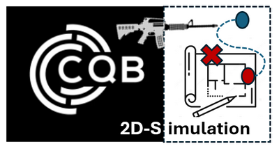
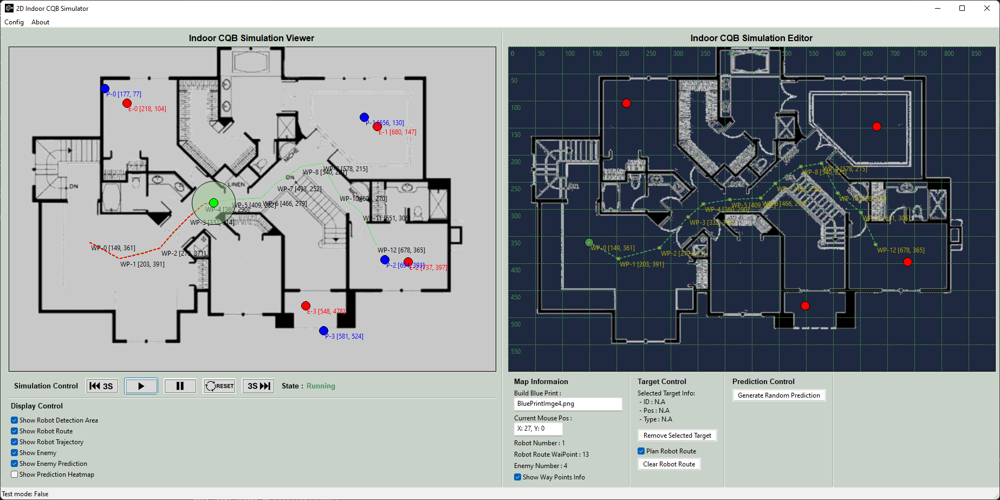

# 2D_Indoor_CQB_Simulator



**Program Design Purpose**: We want to build a 2D tactical board program which can load the building floor blue print, squad position, enemies position, enemy search path for Close-quarters battle (CQB) attack strategy planning and simulate the enemy prediction scenario. The tactical board UI is shown below:



```
# Created:     2024/07/30
# Version:     v_0.1.1
# Copyright:   Copyright (c) 2024 LiuYuancheng
# License:     MIT License
```

[TOC]

------

### Introduction