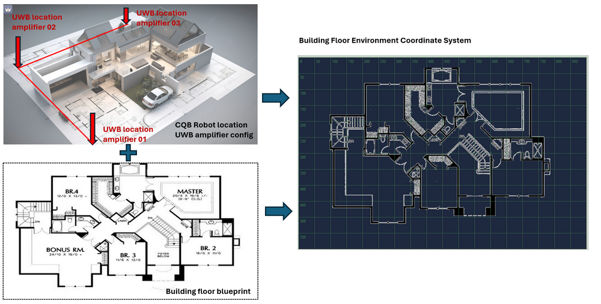
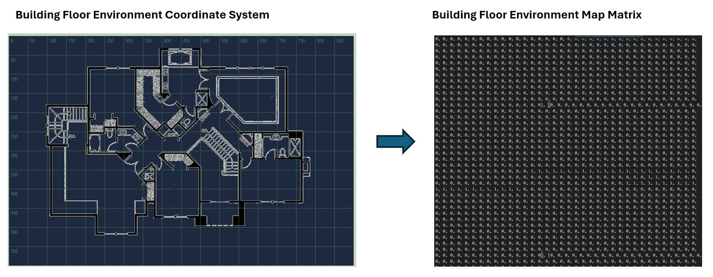
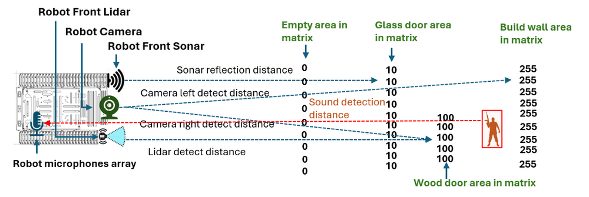
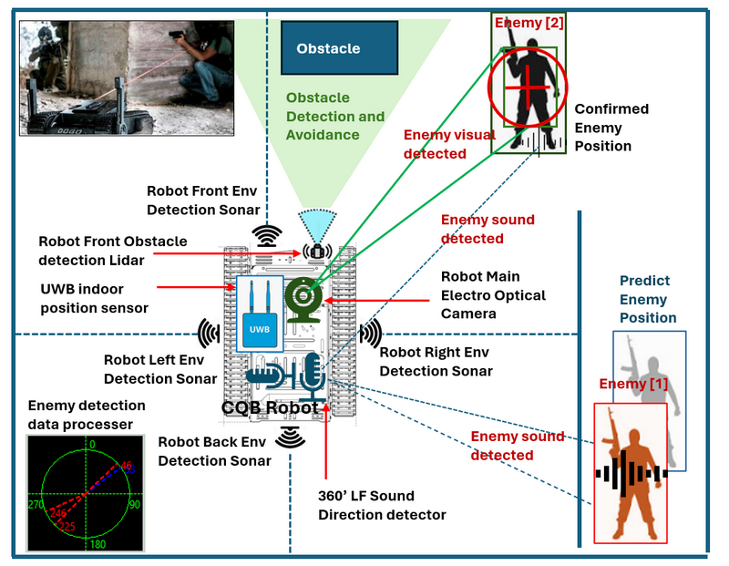
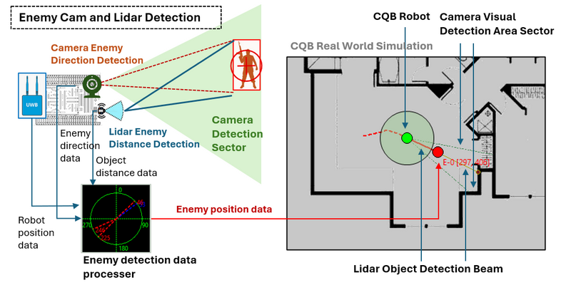
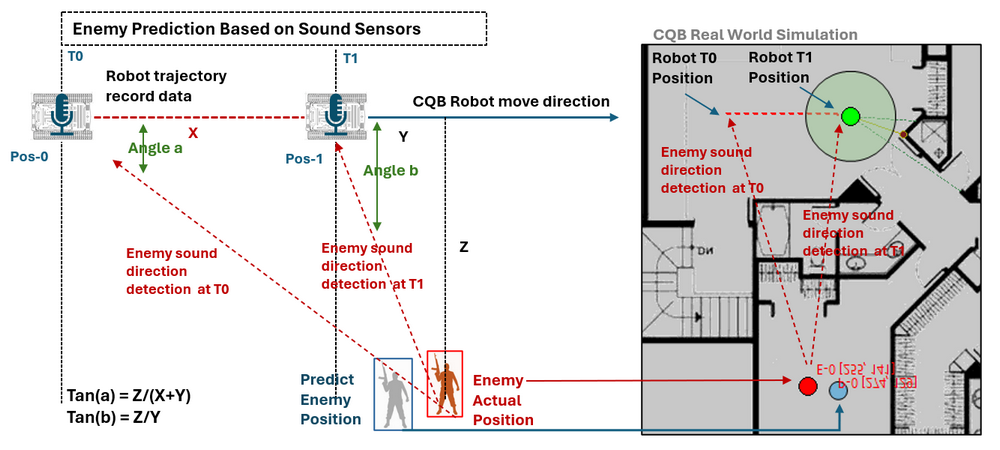

# 2D_Indoor_CQB_Robot_Simulation


**Program Design Purpose**: 

The use of robots in Close Quarters Battle (CQB) is a significant advancement in modern military and law enforcement tactics. The CQB Robots, with their ability to navigate tight spaces, gather real-time intelligence, and even engage threats, have become valuable assets in these high-stakes scenarios. We want to build a 2D tactical board program (like a computer game) which can load the building floor blue print, CQB squad (robot) position, enemies position, enemy search path for simulating Close-quarters battle (CQB) robot's enemy searching strategy planning and prediction scenario. The tactical board UI is shown below:


```
# Created:     2024/07/30
# Version:     v_0.1.1
# Copyright:   Copyright (c) 2024 LiuYuancheng
# License:     MIT License
```

[TOC]

------

### Introduction

2D_Indoor_CQB_Robot_Simulation program will provide 2 main part: the CQB scenario tactical board Editor and the situation simulation viewer. The tactical board editor is used for building a CQB scenario and situation viewer is used to simulate how the CQB robot use its sensors to do combine environment visualization, enemy search and prediction in physical word.  

#### CQB Scenario Tactical Board Editor

In the editor, the user can build a CQB scenario with below steps:

- Step1: load the build indoor blue print in the editor to build the floor plan matrix.
- Step2: Plan the robot start position, then set the robot auto pilot and enemy search path.
- Step3: Adjust the robot motion and detection parameters such as the move speed, sensitivity and detection range of sensors. 
- Step4: Plant the enemy location and enemy's movement strategy (stationary, patrol or random wondering)

After the user config a CQB scenario, then can also save the scenario in file and load it next time when they want to use it.

#### CQB situation simulation viewer

The viewer will simulate the real world situation when robot follow the use's auto enemy search path. The viewer provide the robot auto pilot and user manual control to simulate different operation situation. The viewer will generate all the related real time robot sensor data based on the floor blue print and the enemy config such as 

- Robot sonar detect the wall reflection to calculate the distance between the robot and the wall, 
- Robot front Lidar detect a glass door which robot can not pass, 
- Robot 360' microphones array to identify enemy possible position based on the enemy sound, 
- Robot Electro optical camera detect a enemy behind a glass door from visual analysis. 

The viewer will also visualize the robot's enemy prediction result and during the simulation progress, user can stepping through forward and backward the progress to improve the enemy search path. 

#### Use Case and Future Work

In the future, we also want to integrate AI in the enemy strategy config part to make the enemy's action and interactivities with the environment more like "Human". Then we also want to use the program to train AI to improve the enemy predication and train AI to find the best enemy search path then may be able to apply in the computer game or even provide help for real world CQB combat decision making.


------

### System Design 

The program includes several sub system, in this section will introduce some key feature and how we design the sub systems. 

 

#### CQB Environment simulation design

Before we start simulate the CQB robot, we need to build the environment from the building blue print picture then the robot's sensor can "interactive" with the environment as in the real world. This section will show how we build the environment from the building blue print, we will use the image visualization analysis to convert the blue print to a matrix map. There are 3 steps to build the blue print matrix

**Step1: Build the Floor blue print coordinate system based on the UWB position amplifier** 

Normally the attack square will local 3 UWB position amplifier at a right-angled triangle area to cover the building, then we set the 3 UWB  amplifier's position as the (0,0), (max(x), 0) and (0, max(y))  of our blue print map matrix. Then based on the 3 UWB covered area, we change the loaded blue print picture's scale, then we filled the scaled blue print picture in the coordinate system so the robot self location identification and the building environment are in same 2D coordinate system. 

 

**Step2: Build the Indoor environment matrix** 

After change the blue print in the correct position and scale in the coordinate system, we will use CV to convert the floor blue print to a 2D matrix for the simulation usage. As shown below:

 

For the different element in the 2D matrix, the number will represent the material or the space (the material will be represented by a value in range 1 ~ 255). For example if the area is empty, the space in the map matrix will be filled with value 0 which also identify the robot can move in the area. If there is a glass door of a room, the door area will be filled will value 10 which identify the sonar sensor can not pass but the lidar and camera view can pass the material. The wall will be set to 255 then all the sensor's detection will not pass the area. 


**Step3: Build the robot and environment interaction** 

After build the environment matrix, we will build the interaction module to generate the robot sensor's interaction with the matrix to simulate the real world situation. The interaction example is shown below:



When facing a area with the glass door, wood door(furniture)  and wall, the interaction manager module will floor the sensor's detection direction line from the robot position then check the "material" value one by one on the map matix follow the sensor's detection line. the distance will be calculate until it got the not able passed material value based on the sensors' setting. As shown in the example:

- The movement sound sensor detection will stop until it reach a glass door (material_val = 10 )

- The camera and lidar detection line will pass the glass door  (material_val  = 10 ) but stop at the wood furniture (material_val = 100)

- The sound detection line can pass the wood door (material_val = 100) but stop at the building wall (material_val = 255)

  

#### CQB Robot Sensor's Simulation Design

The sensor system in CQB (Close Quarters Battle) robots is crucial for their ability to navigate, detect threats, and provide real-time intelligence in confined and potentially hostile environments. Normally the CQB robot sensor will includes 8 types:  `Optical Sensors`, `Thermal Imaging Sensors`, `Proximity and Obstacle Detection Sensors`, `Environmental Sensors`,  `Audio Sensors`, `Motion and Vibration Sensors`, `Communication and Signal Sensors` and `Multispectral and Hyperspectral Sensors`.  These sensors enable the robot to perform a variety of tasks, from mapping the environment to identifying potential dangers. 

In our system our program will simulate 5 types of sensors used on the robot, the sensors we want to simulate are shown below:



- **Electro Optical Camera**:  Capture detailed visual data for navigation, threat identification, and situational awareness.
- **UWB Indoor Position Sensor**: Ultra-Wideband (UWB) Positioning Senor for the robot to identify its' location in the building. 
- **Environment Sonars**: Four sonar at the robot 4 direction (front, left, right, back) to detect the environment such as the distance from the robot to the wall. 
- **360' LF Sound Direction Detector**: Low frequency sound microphones array used to capture ambient sounds and the rough sounds source direction, such as footsteps, voices, or the noise of machinery. This audio data can be analyzed to identify potential threats or to determine the presence of people in nearby rooms or behind obstacles.
- **Front LIDAR (Light Detection and Ranging)**: Measures distances by illuminating the target with laser light and measuring the reflection. LIDAR creates a 3D map of the environment, helping the robot navigate through tight spaces and avoid obstacles.

The robot's enemy detection data processer integrates all the data from multiple sensors to create a comprehensive understanding of its environment. The enemy detection data processer will analysis the sensor fusion data and provide the square robot control member the confirmed enemy position and predicted enemy position for accuracy combine visual and decision making.


#### Design of enemy detection and the prediction 

We will simulate the enemy detection and predication progress in our system. 

**Detection Enemy Position**

To detect the enemy position in the map matrix, we will use the camera and lidar sensors. The camera sensor will keep scan the front sector area of the robot the check whether can detect the enemy pixel. When the camera "see" then enemy, as camera has no ability to measure the distance it will send the enemy direction data to the detection data processer module, then the module will use the Lidar to scan the direction to get the object (enemy) distance. Based on the robot own position, enemy direction and  enemy distance, the processer will calculate the enemy location on the map. 

The enemy detection work flow is shown below:



**Predict Enemy Position**

To predict the enemy position, we use the 360' Low frequency sound microphones array. The sound sensor will get the direction of the sound source, when the robot is moving, based on the trajectory recording and the enemy sound source direction data, the enemy data processer will calculate the approximate predicted position of the enemy behind the obstacles. The enemy prediction workflow is shown below:

 

During the predication calculation progress, We have the robot trajectory distance(X) from Time-T0 to Time-T1, the enemy sound direction(a) at Time-T0 with the robot position Pos-0  and the enemy sound direction(b) at Time-T1 with the robot position Pos-1.

```
tan(a) = Z/(X+Y)
tan(b) = Z/Y
```

Then we can calculate the distance Y and Z, based on the Pos-1 we can calculate the enemy predication position.   


