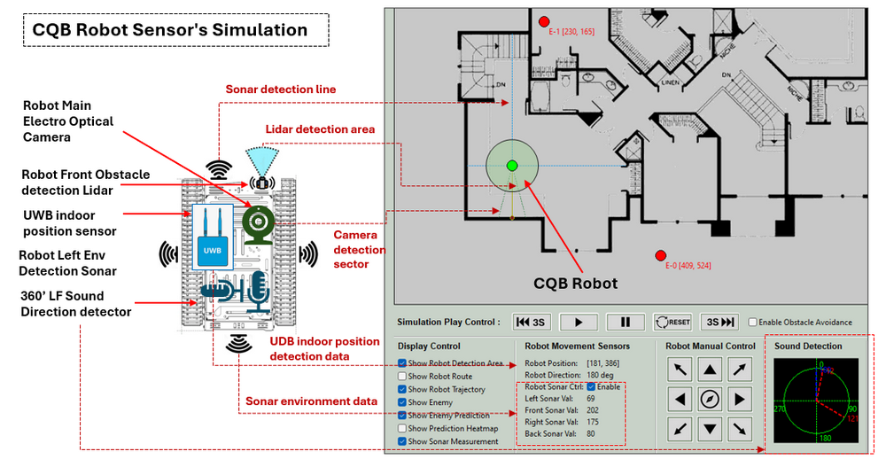

# 2D_Indoor_CQB_Robot_Simulation


**Program Design Purpose**: The integration of robots in Close Quarters Battle (CQB) represents a significant advancement in modern military and law enforcement tactics. These robots, designed to navigate tight spaces, gather real-time intelligence, and engage threats, are invaluable assets in high-stakes scenarios. Our goal is to develop a 2D tactical board simulation system, similar to a computer game, that can load building floor blueprints, display CQB squad (robot) positions, enemy locations, and simulate CQB robot enemy search progress in the real world. This program will allow users (attack squad) to plan CQB robot enemy searching strategies and improve robot's enemy prediction within a controlled environment.

The main user interface of the simulation system is shown below:


```
# Created:     2024/07/30
# Version:     v_0.1.1
# Copyright:   Copyright (c) 2024 LiuYuancheng
# License:     MIT License
```

**Table of Contents**

[TOC]

------

### Introduction

Robots are employed in Close Quarters Battle (CQB) to minimize the risks faced by human soldiers and officers by handling the most hazardous tasks. Equipped with advanced sensors, cameras, and communication systems, CQB robots provide operators with a comprehensive understanding of their environment. Their ability to navigate narrow corridors, stairwells, and cluttered rooms makes them ideal for urban combat and building searches. By relaying live video and audio feeds back to the control center, these robots enable real-time decision-making and seamless coordination with attack squads.

Modern CQB robots are further enhanced by artificial intelligence (AI) and machine learning algorithms, which boost their autonomous capabilities. These technologies allow robots to recognize and respond to threats, navigate complex environments, and communicate effectively with both robotic and human team members.

The **2D Indoor CQB Robot Simulation** program is a simulation tool designed to configure various CQB scenarios, aiding in the improvement of the robot's autopilot, enemy search, and prediction algorithms. The program consists of two main components: the **CQB Scenario Tactical Board Editor** and the **Situation Simulation Viewer**. The Tactical Board Editor allows users to create and configure CQB scenarios, while the Situation Simulation Viewer simulates how the CQB robot utilizes its sensors for environmental visualization, enemy search, and prediction in real-world situations.

#### CQB Scenario Tactical Board Editor Introduction 

The CQB Scenario Tactical Board Editor allows users to create and configure CQB scenarios with the following steps:

- **Step 1**: Load the building's indoor blueprint into the editor to generate the floor map matrix.
- **Step 2**: Set the robot's starting position, then define its autopilot route and enemy search path.
- **Step 3**: Adjust the robot's motion and detection parameters, such as movement speed, sensor sensitivity, and detection range.
- **Step 4**: Place enemies within the scenario and define their movement strategy (e.g., stationary, patrolling, or random wandering).

After finished configuring a CQB scenario, users can save the scenario to a file for future use, allowing them to load and modify it as needed.

#### CQB Situation Simulation Viewer Introduction

The Situation Simulation Viewer replicates real-world conditions as the robot follows the defined enemy search path. The viewer supports both autonomous robot operation and manual control, enabling users to simulate different operational scenarios. It generates real-time sensor data based on the floor blueprint and enemy configuration, such as:

- Sonar detecting wall reflections to calculate the distance between the robot and the building walls.
- Front LIDAR identifying obstacles like glass doors and furniture that the robot cannot pass.
- A 360-degree microphones array pinpointing potential enemy positions based on sound.
- Electro-optical cameras detecting enemies behind glass doors through visual analysis.

The viewer also visualizes the robot's enemy prediction results. During the simulation, users can step forward or backward through the scenario to refine the enemy search path and improve the robot's performance.

#### Use Case and Future Work

In the future, we plan to integrate AI into the enemy strategy configuration, making enemy actions and interactions with the environment more realistic and "human-like." Additionally, we aim to use this program to train AI models to enhance enemy prediction and optimize search paths. This could have applications in computer games or even real-world CQB combat decision-making.


------

### System Design 

The program includes several sub system, in this section will introduce some key feature and how we design the sub systems. such as the CQB Environment simulation design, CQB Robot Sensor's Simulation Design, Design of enemy detection and the prediction algorithm design. 

 

#### CQB Environment simulation design

Before we start simulate the CQB robot, we need to build the environment from the building blue print picture then the robot's sensor can "interactive" with the environment as in the real world. This section will show how we build the environment from the building blue print, we will use the image visualization analysis to convert the blue print to a matrix map. There are 3 steps to build the blue print matrix

**Step1: Build the Floor blue print coordinate system based on the UWB position amplifier** 

Normally the attack square will local 3 UWB position amplifier at a right-angled triangle area to cover the building, then we set the 3 UWB  amplifier's position as the (0,0), (max(x), 0) and (0, max(y))  of our blue print map matrix. Then based on the 3 UWB covered area, we change the loaded blue print picture's scale, then we filled the scaled blue print picture in the coordinate system so the robot self location identification and the building environment are in same 2D coordinate system. 

 

**Step2: Build the Indoor environment matrix** 

After change the blue print in the correct position and scale in the coordinate system, we will use CV to convert the floor blue print to a 2D matrix for the simulation usage. As shown below:

 

For the different element in the 2D matrix, the number will represent the material or the space (the material will be represented by a value in range 1 ~ 255). For example if the area is empty, the space in the map matrix will be filled with value 0 which also identify the robot can move in the area. If there is a glass door of a room, the door area will be filled will value 10 which identify the sonar sensor can not pass but the lidar and camera view can pass the material. The wall will be set to 255 then all the sensor's detection will not pass the area. 


**Step3: Build the robot and environment interaction** 

After build the environment matrix, we will build the interaction module to generate the robot sensor's interaction with the matrix to simulate the real world situation. The interaction example is shown below:


When facing a area with the glass door, wood door(furniture)  and wall, the interaction manager module will floor the sensor's detection direction line from the robot position then check the "material" value one by one on the map matix follow the sensor's detection line. the distance will be calculate until it got the not able passed material value based on the sensors' setting. As shown in the example:

- The movement sound sensor detection will stop until it reach a glass door (material_val = 10 )

- The camera and lidar detection line will pass the glass door  (material_val  = 10 ) but stop at the wood furniture (material_val = 100)

- The sound detection line can pass the wood door (material_val = 100) but stop at the building wall (material_val = 255)

  

#### CQB Robot Sensor's Simulation Design

The sensor system in CQB (Close Quarters Battle) robots is crucial for their ability to navigate, detect threats, and provide real-time intelligence in confined and potentially hostile environments. Normally the CQB robot sensor will includes 8 types:  `Optical Sensors`, `Thermal Imaging Sensors`, `Proximity and Obstacle Detection Sensors`, `Environmental Sensors`,  `Audio Sensors`, `Motion and Vibration Sensors`, `Communication and Signal Sensors` and `Multispectral and Hyperspectral Sensors`.  These sensors enable the robot to perform a variety of tasks, from mapping the environment to identifying potential dangers. 

In our system our program will simulate 5 types of sensors used on the robot, the sensors we want to simulate are shown below:


- **Electro Optical Camera**:  Capture detailed visual data for navigation, threat identification, and situational awareness.
- **UWB Indoor Position Sensor**: Ultra-Wideband (UWB) Positioning Senor for the robot to identify its' location in the building. 
- **Environment Sonars**: Four sonar at the robot 4 direction (front, left, right, back) to detect the environment such as the distance from the robot to the wall. 
- **360' LF Sound Direction Detector**: Low frequency sound microphones array used to capture ambient sounds and the rough sounds source direction, such as footsteps, voices, or the noise of machinery. This audio data can be analyzed to identify potential threats or to determine the presence of people in nearby rooms or behind obstacles.
- **Front LIDAR (Light Detection and Ranging)**: Measures distances by illuminating the target with laser light and measuring the reflection. LIDAR creates a 3D map of the environment, helping the robot navigate through tight spaces and avoid obstacles.

The sensor usage and display map to the 2D scenario viewer is shown below:



The robot's enemy detection data processer integrates all the data from multiple sensors to create a comprehensive understanding of its environment. The enemy detection data processer will analysis the sensor fusion data and provide the square robot control member the confirmed enemy position and predicted enemy position for accuracy combine visual and decision making.


#### Design of enemy detection and the prediction 

We will simulate the enemy detection and predication progress in our system. 

**Detection Enemy Position**

To detect the enemy position in the map matrix, we will use the camera and lidar sensors. The camera sensor will keep scan the front sector area of the robot the check whether can detect the enemy pixel. When the camera "see" then enemy, as camera has no ability to measure the distance it will send the enemy direction data to the detection data processer module, then the module will use the Lidar to scan the direction to get the object (enemy) distance. Based on the robot own position, enemy direction and  enemy distance, the processer will calculate the enemy location on the map. 

The enemy detection work flow is shown below:


**Predict Enemy Position**

To predict the enemy position, we use the 360' Low frequency sound microphones array. The sound sensor will get the direction of the sound source, when the robot is moving, based on the trajectory recording and the enemy sound source direction data, the enemy data processer will calculate the approximate predicted position of the enemy behind the obstacles. The enemy prediction workflow is shown below:

 

During the predication calculation progress, We have the robot trajectory distance(X) from Time-T0 to Time-T1, the enemy sound direction(a) at Time-T0 with the robot position Pos-0  and the enemy sound direction(b) at Time-T1 with the robot position Pos-1.

```
tan(a) = Z/(X+Y)
tan(b) = Z/Y
```

Then we can calculate the distance Y and Z, based on the Pos-1 we can calculate the enemy predication position.   


------

### System Setup