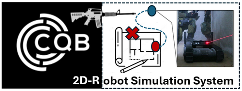

# 2D_Indoor_CQB_Robot_Simulation



**Program Design Purpose**: 

The use of robots in Close Quarters Battle (CQB) is a significant advancement in modern military and law enforcement tactics. The CQB Robots, with their ability to navigate tight spaces, gather real-time intelligence, and even engage threats, have become valuable assets in these high-stakes scenarios. We want to build a 2D tactical board program (like a computer game) which can load the building floor blue print, CQB squad (robot) position, enemies position, enemy search path for simulating Close-quarters battle (CQB) robot's enemy searching strategy planning and prediction scenario. The tactical board UI is shown below:


```
# Created:     2024/07/30
# Version:     v_0.1.1
# Copyright:   Copyright (c) 2024 LiuYuancheng
# License:     MIT License
```

[TOC]

------

### Introduction

Demo video.


#### CQB Robot Sensor's Simulation Introduction

The sensor system in CQB (Close Quarters Battle) robots is crucial for their ability to navigate, detect threats, and provide real-time intelligence in confined and potentially hostile environments. Normally the CQB robot sensor will includes 8 types:  `Optical Sensors`, `Thermal Imaging Sensors`, `Proximity and Obstacle Detection Sensors`, `Environmental Sensors`,  `Audio Sensors`, `Motion and Vibration Sensors`, `Communication and Signal Sensors` and `Multispectral and Hyperspectral Sensors`.  These sensors enable the robot to perform a variety of tasks, from mapping the environment to identifying potential dangers. The sensors we want to simulate are shown below:


- **Electro Optical Camera**:  Capture detailed visual data for navigation, threat identification, and situational awareness.
- **UWB Indoor Position Sensor**: Ultra-Wideband (UWB) Positioning Senor for the robot to identify its' location in the building. 
- **Environment Sonars**: Four sonar at the robot 4 direction (front, left, right, back) to detect the environment such as the distance from the robot to the wall. 
- **360' LF Sound Direction Detector**: Low frequency sound microphones array used to capture ambient sounds and the rough sounds source direction, such as footsteps, voices, or the noise of machinery. This audio data can be analyzed to identify potential threats or to determine the presence of people in nearby rooms or behind obstacles.
- **Front LIDAR (Light Detection and Ranging)**: Measures distances by illuminating the target with laser light and measuring the reflection. LIDAR creates a 3D map of the environment, helping the robot navigate through tight spaces and avoid obstacles.

The robot's enemy detection data processer integrates all the data from multiple sensors to create a comprehensive understanding of its environment. The enemy detection data processer will analysis the sensor fusion data and provide the square robot control member the confirmed enemy position and predicted enemy position for accuracy combine visual and decision making.


